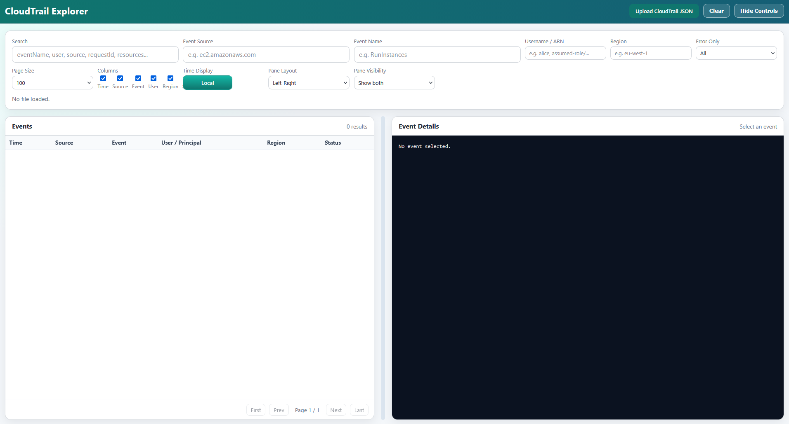

# CloudTrail Explorer

A simple static web page for exploring CloudTrail JSON logs locally.

## Why?

Because CloudTrail sucks

## Features

- Upload CloudTrail JSON (`Records` array or event arrays)
- Fast search and filtering (including negation with `!query`)
- Sortable events table
- Event details with JSON syntax highlighting
- UTC/local time toggle
- Pagination controls (`First`, `Prev`, `Next`, `Last`) and `All` page size
- Column visibility toggles
- Resizable events/details panes and layout options

## Run locally

Because this is a static app, you can open `index.html` directly, or run a local server:

```bash
python3 -m http.server 8000
```

Then open: `http://localhost:8000`

## Screenshot


